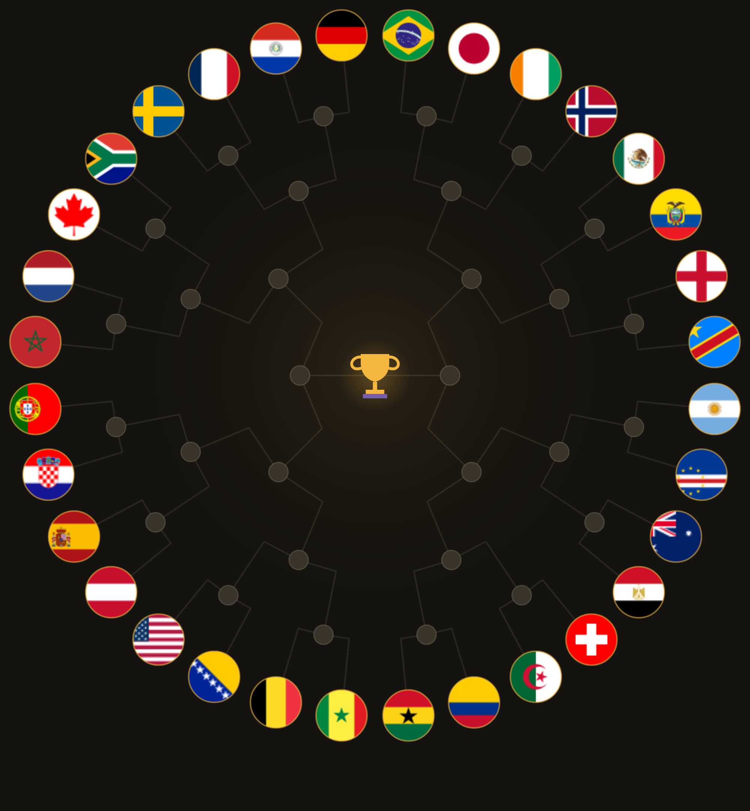

# FIFA World Cup 2026 — Bracket Simulator

[](https://msisaif.github.io/FIFA-World-Cup-2026/)
[](https://github.com/msisaif/FIFA-World-Cup-2026/actions/workflows/static.yml)

An interactive FIFA World Cup 2026 bracket simulator built with pure vanilla JavaScript. Click team flags to advance them through each round and predict your champion.



---

## Live Demo

**[msisaif.github.io/FIFA-World-Cup-2026](https://msisaif.github.io/FIFA-World-Cup-2026/)**

---

## Features

- Circular bracket visualization — Round of 32 all the way to the Final
- Click a team flag to advance it to the next round
- Confirmed real-world results are locked in (shown in green, cannot be changed)
- Must complete each round before advancing inward
- Trophy reveal at center when a champion is crowned
- Animated feedback on invalid interactions
- Export bracket as a PNG — copy to clipboard or download
- Fully responsive — scales to any screen size
- No build tools, no frameworks — pure HTML/CSS/JS

---

## Tech Stack

| Layer | Technology |
|---|---|
| Markup | HTML5 (semantic, Open Graph meta tags) |
| Styling | CSS3 — custom properties, container queries, radial gradients |
| Logic | Vanilla JavaScript (~668 lines, no dependencies) |
| Graphics | SVG polylines for bracket edges, Canvas API for PNG export |
| Flags | [flagcdn.com](https://flagcdn.com) (lazy-loaded, CORS-enabled) |
| Hosting | GitHub Pages via GitHub Actions |

---

## Getting Started

No build step required — but the app fetches `data/teams.json` and
`data/results.json` at runtime, so it must be served over `http(s)://`.
Opening `index.html` directly as a `file://` URL will fail silently
(browsers block `fetch()` of local files under that protocol).

```bash
git clone https://github.com/msisaif/FIFA-World-Cup-2026.git
cd FIFA-World-Cup-2026
python -m http.server 8000
# then open http://localhost:8000 in any modern browser
```

Or use VS Code's Live Server extension for auto-reload during development.

---

## Project Structure

```
FIFA-World-Cup-2026/
├── index.html              # App entry point (markup + OG meta tags)
├── assets/
│   ├── css/style.css       # Styles, CSS variables, responsive layout
│   ├── js/script.js        # All application logic
│   └── og.png              # Social preview image
└── data/
    ├── teams.json          # 32 teams — name, flag code, FIFA code, colors
    └── results.json        # Confirmed match results (locked in bracket)
```

---

## Data Files

### `data/teams.json`
Contains the 32 competing teams. Each entry has:
- `n` — full team name
- `c` — country code for flagcdn.com (e.g. `"br"` for Brazil)
- `k` — FIFA three-letter code (e.g. `"BRA"`)
- `col` — array of 3 hex colors used as fallback gradient

### `data/results.json`
Stores confirmed real-world match results by round (`r32`, `r16`, `qf`, `sf`, `final`). Teams listed here are locked winners — their match cells are shown in green and cannot be overridden by clicking.

---

## How to Play

1. Open the app in your browser
2. Start at the **outer ring** (Round of 32 — 32 teams)
3. **Click a team flag** to advance that team to the next round — the other team is dimmed as a loser
4. Complete all matches in the current round before the next ring unlocks
5. Keep picking winners inward through Round of 16, Quarter-finals, Semi-finals, and the Final
6. The **champion** is revealed at the center with a trophy

> Teams with a **green** highlight are confirmed real-world results and cannot be changed.

---

## Export

Once you've filled in the bracket, use the buttons at the top:

- **Copy** — copies the bracket as a PNG image to your clipboard
- **Download** — saves the bracket as a PNG file to your device
- **Reset** — clears all your picks and starts over

---

## License

MIT
